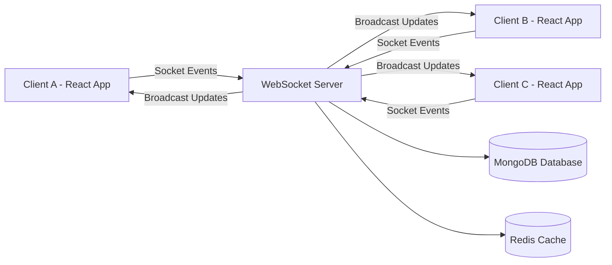
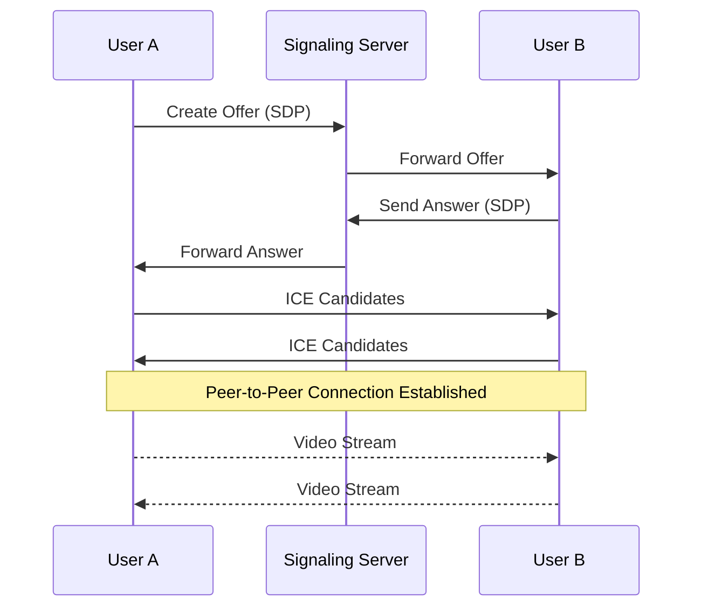

<div align="center">

# 💬 VibeTalk

### ⚡ Next-Generation Real-Time Communication Platform

Real-time Chat • WebRTC Video Calls • Watch Parties • Collaborative Whiteboard • Shared Music

<br>


<br><br>

A modern **full-stack real-time communication platform** designed to simulate **production-grade messaging systems** with low latency and scalable architecture.

</div>

---

# 🚀 Core Features

<div align="center">

| 💬 Real-Time Messaging        | 👥 Friends & Groups           | 📞 Voice & Video Calls      |
| ----------------------------- | ----------------------------- | --------------------------- |
| Instant chat using WebSockets | Username-based friend system  | Peer-to-peer WebRTC calls   |
| Real-time message sync        | Send / accept friend requests | Low-latency media streaming |
| Online / offline presence     | Create chat groups            | Audio + video support       |
| Chat history persistence      | Group messaging               | Secure peer connections     |

</div>

<br>

<div align="center">

| 🖼 Media Sharing    | 🎬 Watch Party         | 🎨 Whiteboard         |
| ------------------- | ---------------------- | --------------------- |
| Send images in chat | Watch YouTube together | Collaborative drawing |
| Instant preview     | Synced playback        | Multiple tools        |
| Cloudinary storage  | Host control           | Real-time updates     |
| Optimized uploads   | Live chat              | Socket synced board   |

</div>

<br>

<div align="center">

| 🎵 Music Sync       | 🌙 Theme System     | ⚡ Real-Time Sync          |
| ------------------- | ------------------- | ------------------------- |
| Shared music player | Dark / light mode   | Event-driven system       |
| Synced playback     | Persistent settings | Instant UI updates        |
| Integrated audio UI | Smooth transitions  | Low latency communication |

</div>

---

# 🛠 Tech Stack

| Category                    | Technology              |
| --------------------------- | ----------------------- |
| **Frontend**                | React + Vite            |
| **Language**                | JavaScript / TypeScript |
| **Styling**                 | TailwindCSS             |
| **Animations**              | Framer Motion           |
| **State Management**        | Zustand + Context API   |
| **Real-Time Communication** | WebSockets              |
| **Video Calls**             | WebRTC                  |
| **Backend**                 | Node.js + Express       |
| **Database**                | MongoDB                 |
| **Caching**                 | Redis                   |
| **File Storage**            | Cloudinary              |
| **Deployment**              | Vercel + Render         |

---

# 📸 Application Gallery

<p align="center">
A visual walkthrough of the core features of <b>VibeTalk</b>.
</p>

---

## 💬 Chat Experience

<p align="center">

</p>

<p align="center">
Modern messaging interface with instant message delivery and presence indicators.
</p>

---

## 👥 Social System

<table align="center">
<tr>

<td align="center" width="50%">


**Friends Panel**

Manage friends and send requests.

</td>

<td align="center" width="50%">


**Group Chat**

Collaborate with multiple users.

</td>

</tr>
</table>

---

## 📞 Video Calling

<p align="center">

</p>

<p align="center">
Peer-to-peer WebRTC video calls with low latency streaming.
</p>

---

## 🎬 Watch Party

<table align="center">
<tr>

<td align="center" width="50%">


**Create Party**

Host synchronized watch sessions.

</td>

<td align="center" width="50%">


**Watch Together**

Playback stays synced for all users.

</td>

</tr>
</table>

---

## 🎨 Collaborative Whiteboard

<p align="center">

</p>

<p align="center">
Draw and collaborate in real time using socket-synchronized canvas events.
</p>

---

## 🎵 Shared Music Player

<p align="center">

</p>

<p align="center">
Listen to music together with synchronized playback.
</p>

---
# ⚡ Real-Time Architecture



### Explanation

* Clients connect to the **WebSocket server**
* Messages and events are sent as **socket events**
* Server processes and **broadcasts updates**
* MongoDB stores persistent data (messages, users, groups)
* Redis handles **caching and performance optimization**

---

# 📞 WebRTC Video Call Flow



### Explanation

1. User A creates a **WebRTC offer**
2. Offer is sent through the **signaling server**
3. User B responds with an **answer**
4. Both exchange **ICE candidates**
5. A **peer-to-peer media connection** is established
6. Video/audio stream flows directly between users


# ⚙️ Local Development

### Clone repository

```bash
git clone https://github.com/your-username/vibetalk.git
cd vibetalk
```

### Install dependencies

```bash
npm install
```

### Setup environment variables

Create `.env`

```
PORT=5000
JWT_SECRET=your_secret
DATABASE_URL=your_database_url
```

### Start development server

```bash
npm run dev
```

---

# 🚀 Deployment

| Service  | Platform   |
| -------- | ---------- |
| Frontend | Vercel     |
| Backend  | Render     |
| Storage  | Cloudinary |
| Cache    | Redis      |

---

# 🔮 Future Improvements

* Message reactions
* File sharing
* Screen sharing
* End-to-end encryption
* Push notifications
* Mobile application

---

<div align="center">

# 👨‍💻 Author

**Raghav Sharma**

⭐ If you like this project, consider giving it a star!

</div>
