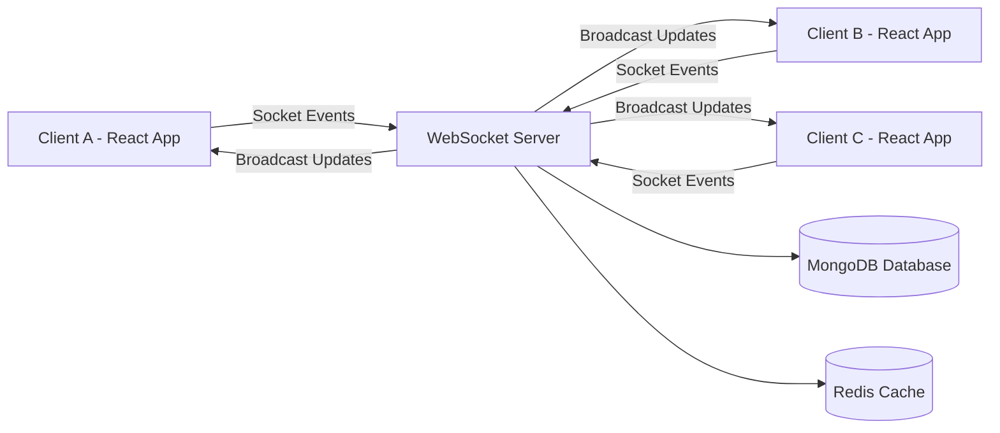
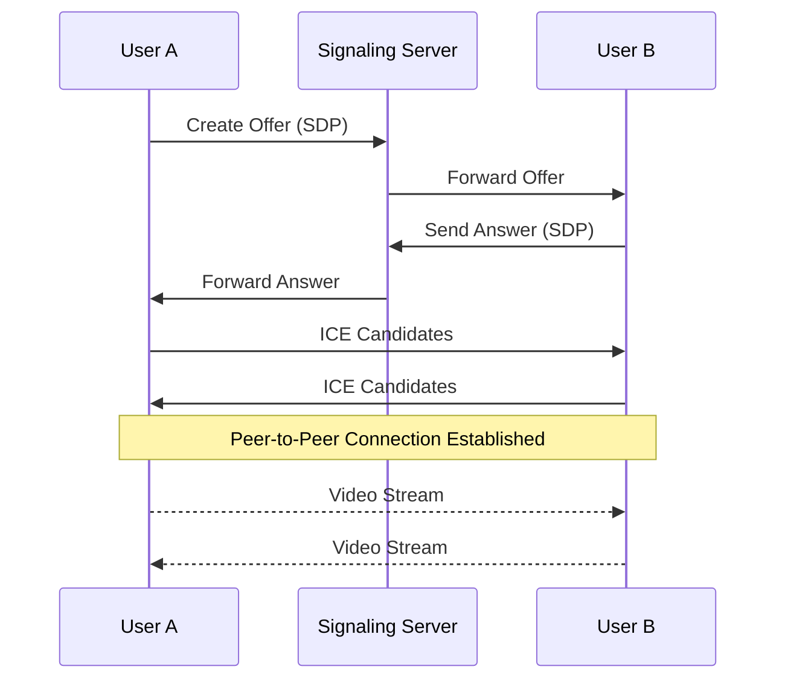

<div align="center">

# 💬 VibeTalk

### ⚡ Next-Generation Real-Time Communication Platform

Real-time Chat • WebRTC Video Calls • Watch Parties • Collaborative Whiteboard • Shared Music

<br>


<br><br>

A modern **full-stack real-time communication platform** designed to simulate **production-grade messaging systems** with low latency and scalable architecture.

</div>

---

# 🚀 Core Features

<div align="center">

| 💬 Real-Time Messaging             | 👥 Friends & Groups           | 📞 Voice & Video Calls        |
| ---------------------------------- | ----------------------------- | ----------------------------- |
| Instant chat using **WebSockets**  | Username-based friend system  | Peer-to-peer **WebRTC calls** |
| Real-time message synchronization  | Send / accept friend requests | Low-latency media streaming   |
| Online / offline presence tracking | Create chat groups            | Audio & video support         |
| Chat history persistence           | Group messaging               | Secure peer connections       |

</div>

<br>

<div align="center">

| 🖼 Media Sharing        | 🎬 Watch Party            | 🎨 Collaborative Whiteboard     |
| ----------------------- | ------------------------- | ------------------------------- |
| Send images inside chat | Watch YouTube together    | Real-time collaborative drawing |
| Instant media preview   | Synchronized playback     | Multiple drawing tools          |
| Cloudinary storage      | Host control system       | Live canvas updates             |
| Optimized uploads       | Live chat during playback | Socket-synchronized board       |

</div>

<br>

<div align="center">

| 🎵 Shared Music       | 🌙 Theme System          | ⚡ Real-Time Sync          |
| --------------------- | ------------------------ | ------------------------- |
| Shared music player   | Dark / light mode        | Event-driven architecture |
| Synchronized playback | Persistent user settings | Instant UI updates        |
| Integrated player UI  | Smooth transitions       | Low latency communication |

</div>

---

# 🛠 Tech Stack

| Category                    | Technology              |
| --------------------------- | ----------------------- |
| **Frontend**                | React + Vite            |
| **Language**                | JavaScript / TypeScript |
| **Styling**                 | TailwindCSS             |
| **Animations**              | Framer Motion           |
| **State Management**        | Zustand + Context API   |
| **Real-Time Communication** | WebSockets              |
| **Video Calls**             | WebRTC                  |
| **Backend**                 | Node.js + Express       |
| **Database**                | MongoDB                 |
| **Caching**                 | Redis                   |
| **File Storage**            | Cloudinary              |
| **Deployment**              | Vercel + Render         |

---

# 📸 Application Gallery

<p align="center">
A quick visual walkthrough of <b>VibeTalk</b> showcasing the real-time communication and collaboration features.
</p>

---

## 💬 Chat Experience

<p align="center">

</p>

---

## 👥 Social System

<div align="center">

| Friends Panel                                                                                                       | Group Chat                                                                                                                              |
| ------------------------------------------------------------------------------------------------------------------- | --------------------------------------------------------------------------------------------------------------------------------------- |
|  |  |

</div>

---

## 📞 Audio & Video Calling

<div align="center">

| Video Call                                                                                 | Voice Call                                                                          |
| ------------------------------------------------------------------------------------------ | ----------------------------------------------------------------------------------- |
|  |  |

</div>

---

## 🎬 Watch Party

<div align="center">

| Create Party                                                                                                                            | Watch Together                                                                                                                    |
| --------------------------------------------------------------------------------------------------------------------------------------- | --------------------------------------------------------------------------------------------------------------------------------- |
|  |  |

</div>

---

## 🎨 Collaborative Whiteboard

<p align="center">

</p>

---

## 🎵 Shared Music Player

<div align="center">

| Music Player                                                                                                                            |
| --------------------------------------------------------------------------------------------------------------------------------------- |
|  |

</div>

---

# ⚡ Real-Time Architecture



### Explanation

• Clients connect to the **WebSocket server**
• Messages and events are emitted as **socket events**
• Server processes events and **broadcasts updates**
• MongoDB stores persistent data
• Redis improves performance via caching

---

# 📞 WebRTC Video Call Flow



---

# ⚙️ Local Development

### Clone repository

```bash
git clone https://github.com/your-username/vibetalk.git
cd vibetalk
```

### Install dependencies

```bash
npm install
```

### Configure environment variables

Create `.env`

```
PORT=5000
JWT_SECRET=your_secret
DATABASE_URL=your_database_url
```

### Start development server

```bash
npm run dev
```

---

# 🚀 Deployment

| Service  | Platform   |
| -------- | ---------- |
| Frontend | Vercel     |
| Backend  | Render     |
| Storage  | Cloudinary |
| Cache    | Redis      |

---

# 🔮 Future Improvements

• Message reactions
• File sharing
• Screen sharing
• End-to-end encryption
• Push notifications
• Mobile application

---

<div align="center">

# 👨‍💻 Author

**Raghav Sharma**

⭐ If you like this project, consider giving it a star!

</div>
