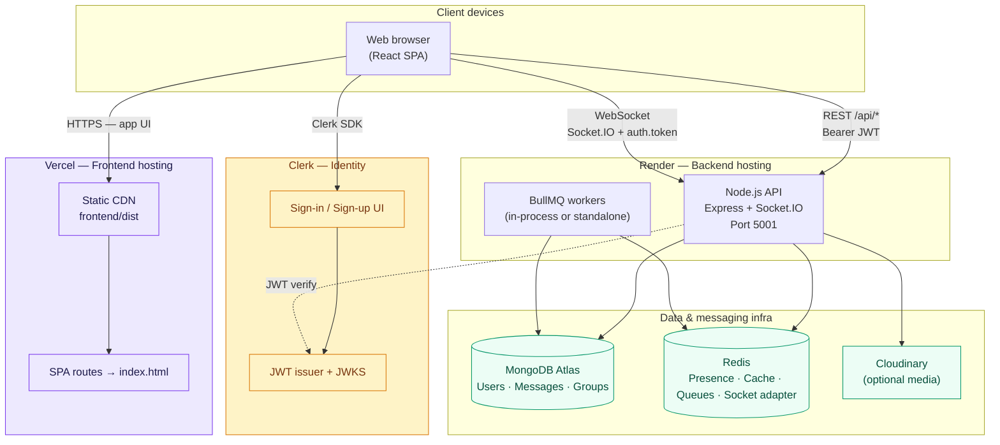
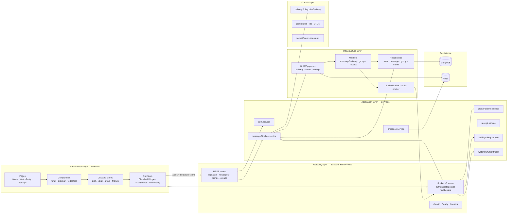
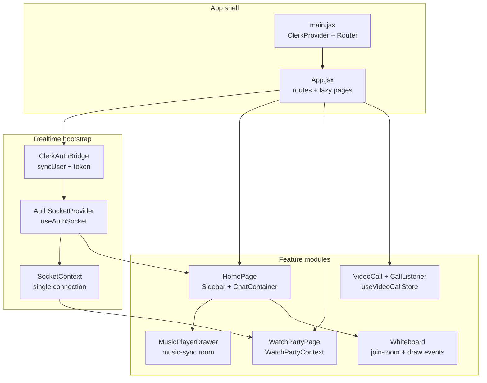
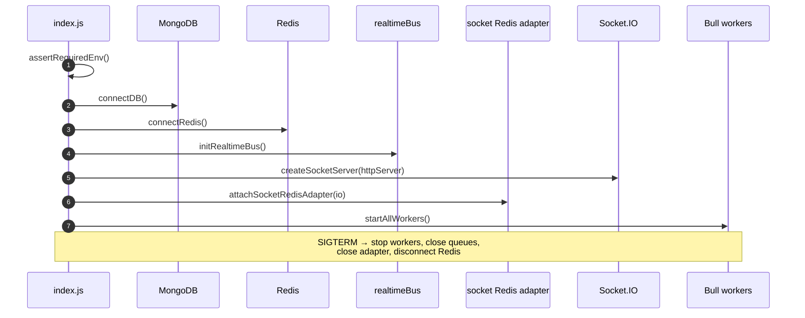

# System Overview — Complete Website Architecture

High-level view of **NexAura (VibeTalk)**: clients, edge hosting, API server, data stores, and real-time infrastructure.

---

## 1. Production deployment topology

| Layer | Technology | Role |
|-------|------------|------|
| **Frontend** | React 18 + Vite + Zustand | Chat UI, calls, watch party, settings |
| **Auth** | Clerk (`@clerk/clerk-react`) | Login; backend validates Clerk JWT |
| **API** | Express 4 | REST: auth, messages, friends, groups |
| **Realtime** | Socket.IO 4 | Live messages, presence, calls, watch party |
| **Primary DB** | MongoDB (Mongoose) | Persistent users, DMs, groups |
| **Redis** | ioredis + BullMQ | Online set, thread cache, job queues, multi-instance sockets |
| **Deploy** | `vercel.json` + `render.yaml` | Frontend on Vercel, backend on Render |

---

## 2. Application layers (logical architecture)

---

## 3. Frontend module map

---

## 4. Backend boot sequence

---

## Key environment links

| Frontend (Vercel) | Backend (Render) |
|-------------------|------------------|
| `VITE_CLERK_PUBLISHABLE_KEY` | `CLERK_JWT_ISSUER` |
| `VITE_BACKEND_URL` → API base | `MONGODB_URI` |
| `VITE_SOCKET_URL` (optional) | `REDIS_URL` |
| | `CORS_ORIGINS` (must include Vercel URL) |

**Related diagrams:** [Messaging](./02-messaging.md) · [WebRTC](./03-webrtc.md) · [Socket](./04-socket-realtime.md) · [Redis & Watch Party](./05-redis-pipeline-and-watch-party.md)
