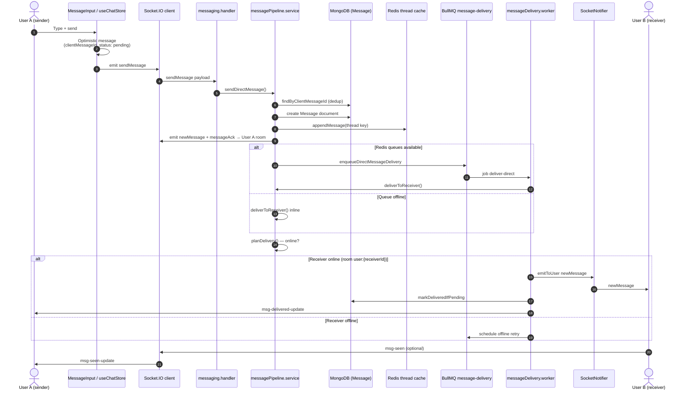
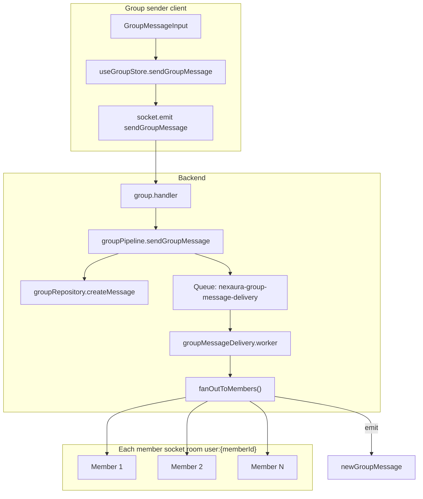
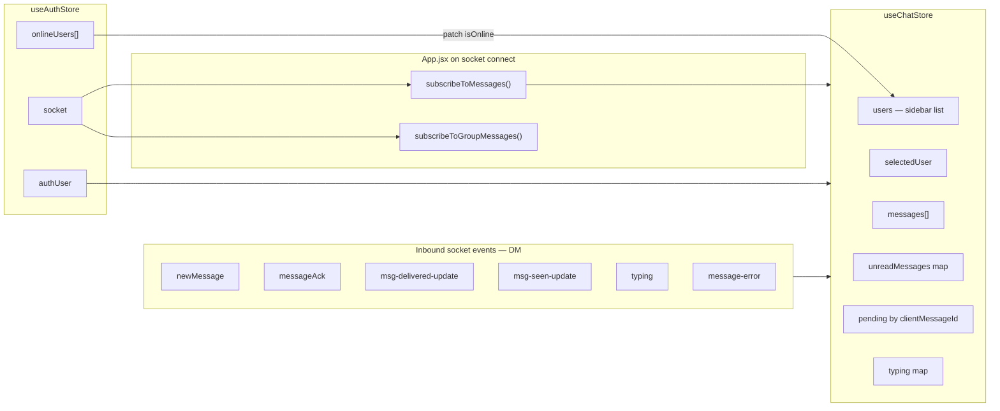
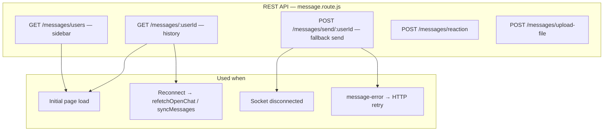
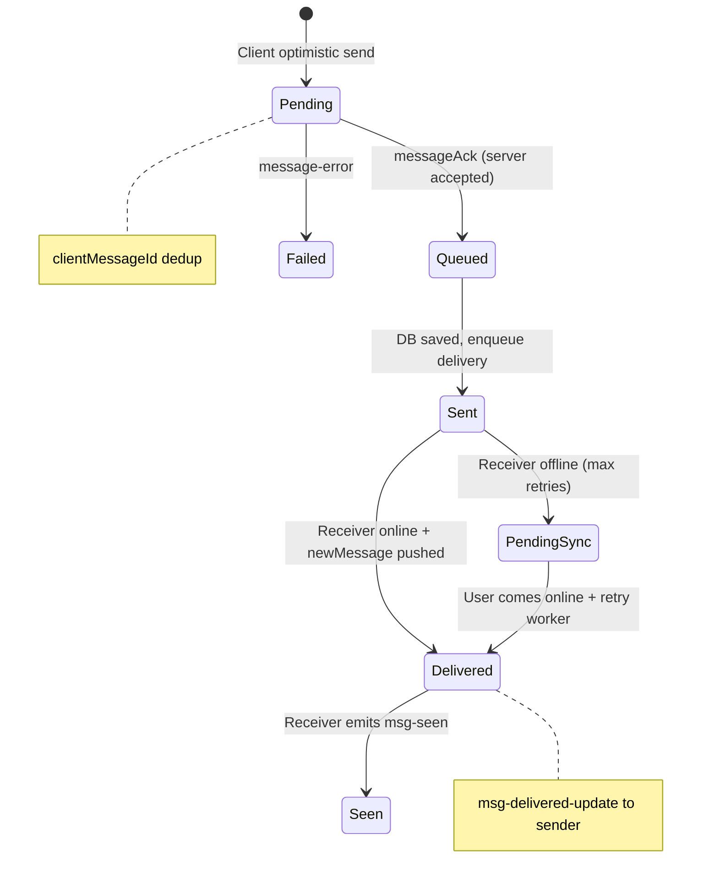

# Messaging Architecture

How **direct messages (1:1)** and **group messages** flow from the UI through REST/Socket.IO to MongoDB and back to recipients.

---

## 1. Direct message — end-to-end flow

---

## 2. Group message — fan-out flow

| Step | Component | Output event / data |
|------|-----------|---------------------|
| Send | `sendGroupMessage` socket event | Validates membership |
| Persist | `GroupMessage` model | `groupId`, `senderId`, content |
| Fan-out | Worker or sync path | `newGroupMessage` per member |
| Sidebar | REST `GET /groups` | Group list + unread counts |

---

## 3. Client-side messaging state

---

## 4. REST fallback & history sync

---

## 5. Message lifecycle & delivery states

---

## Data models (MongoDB)

| Model | File | Purpose |
|-------|------|---------|
| **Message** | `models/message.model.js` | 1:1 DMs: senderId, receiverId, text/media, delivered, seen, reactions |
| **Group** | `models/group.model.js` | members[], roles (admin/member) |
| **GroupMessage** | `models/groupMessage.model.js` | Group channel messages |
| **FriendRequest** | `models/friendRequest.model.js` | Friend graph (no separate Friend collection) |

**Thread cache (Redis):** `thread:{idA}:{idB}` — last 50 messages, TTL 600s (`conversationCache.service.js`).

**Related:** [Socket architecture](./04-socket-realtime.md) · [Redis pipeline](./05-redis-pipeline-and-watch-party.md)
