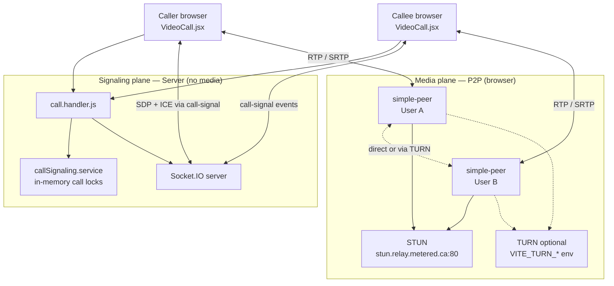
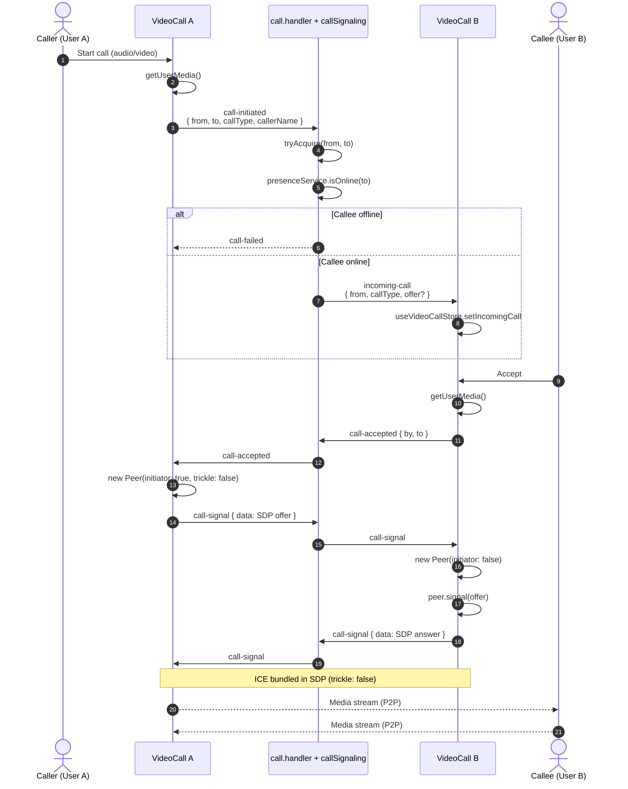
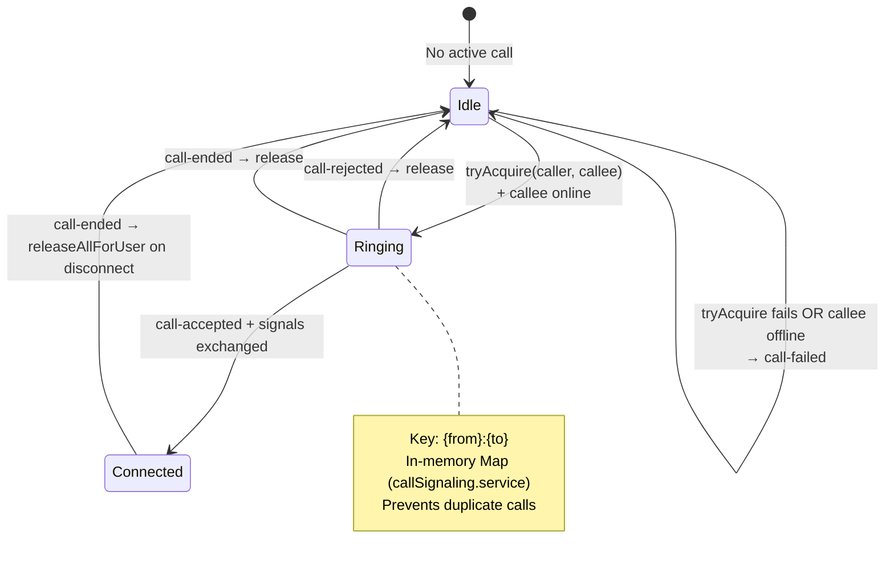
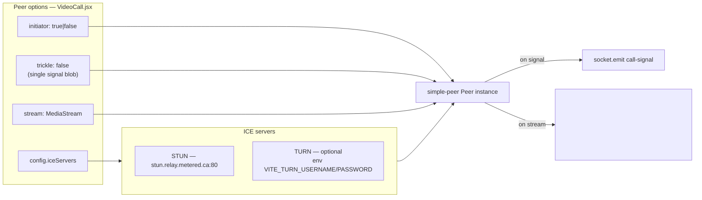
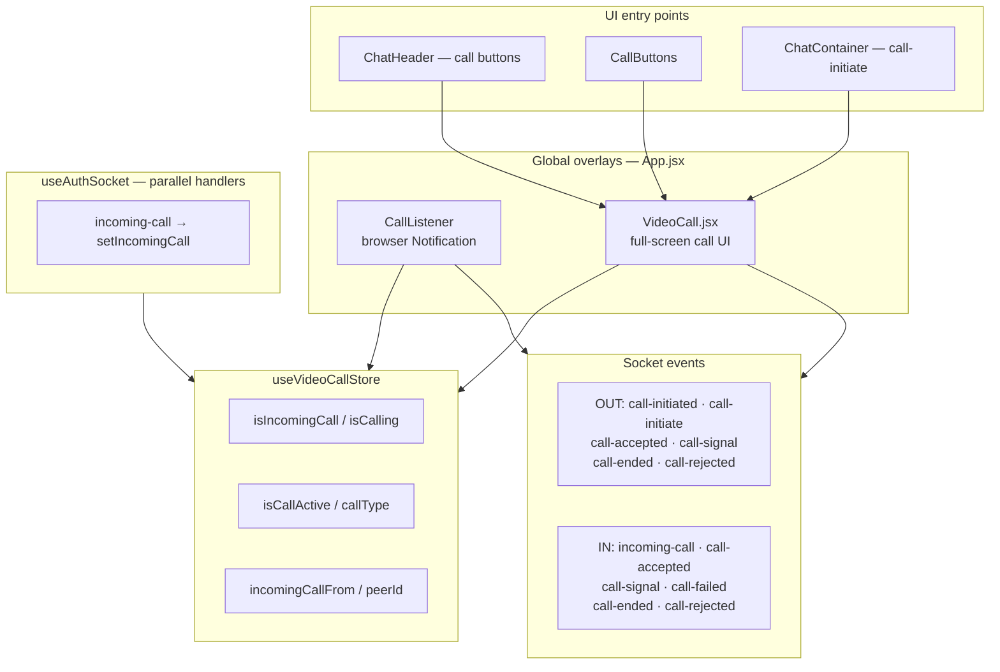
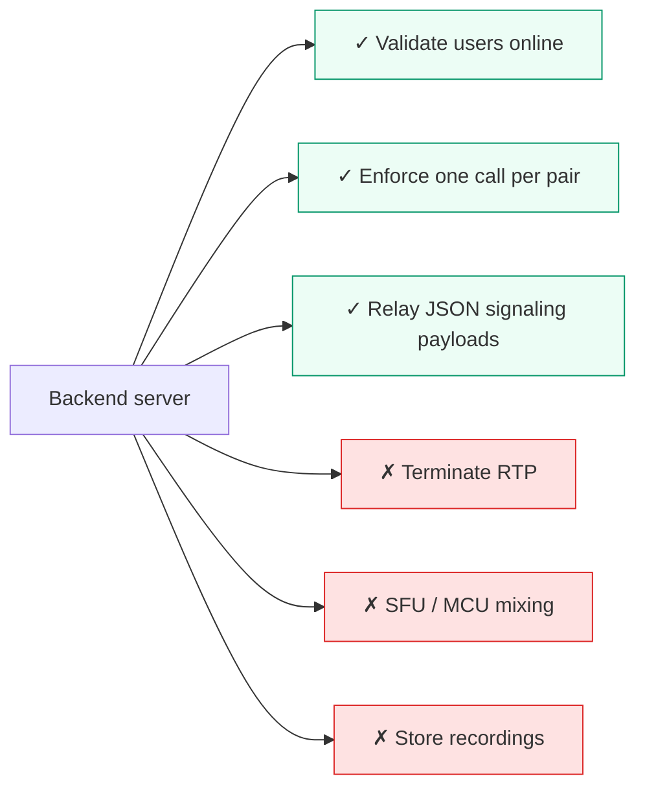

# WebRTC Architecture — Voice & Video Calls

NexAura uses **Socket.IO for signaling only**; audio/video media flows **peer-to-peer** via **simple-peer** in the browser.

---

## 1. High-level call architecture

| Plane | Carries | Server role |
|-------|---------|-------------|
| **Signaling** | call-initiated, call-accepted, call-signal, call-ended | Relay + busy/online checks |
| **Media** | Camera/mic streams | None — WebRTC P2P |

---

## 2. Call setup sequence (successful path)

---

## 3. Signaling state machine (server-side lock)

---

## 4. simple-peer configuration (client)

---

## 5. Frontend components & events

---

## 6. What the server does NOT do

**Files:** `backend/src/handlers/call.handler.js` · `backend/src/services/callSignaling.service.js` · `frontend/src/components/VideoCall.jsx` · `frontend/src/components/CallListener.jsx`

**Related:** [Socket architecture](./04-socket-realtime.md) · [System overview](./01-system-overview.md)
