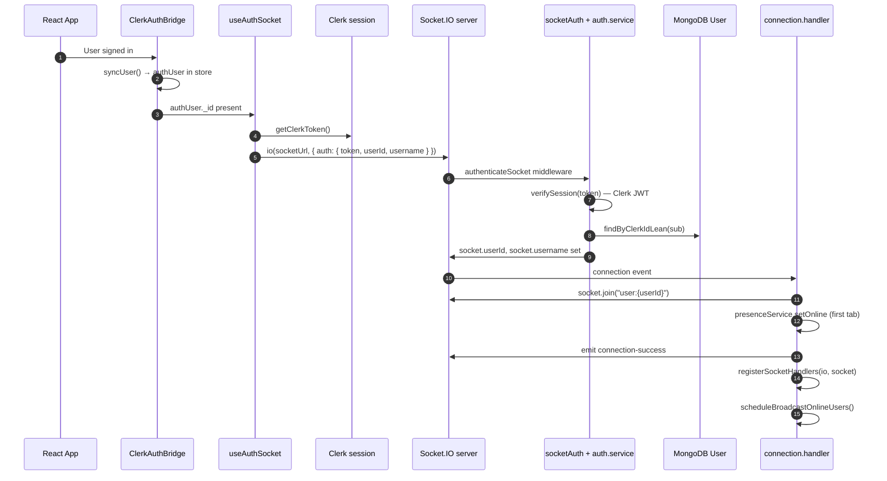
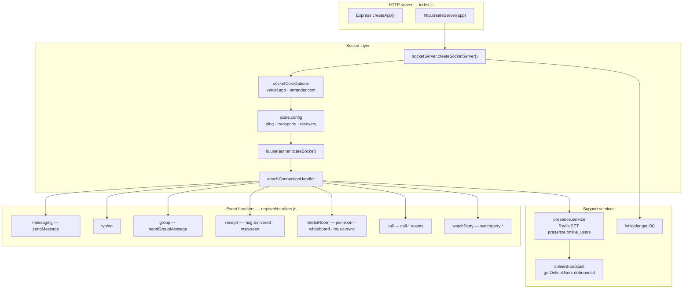
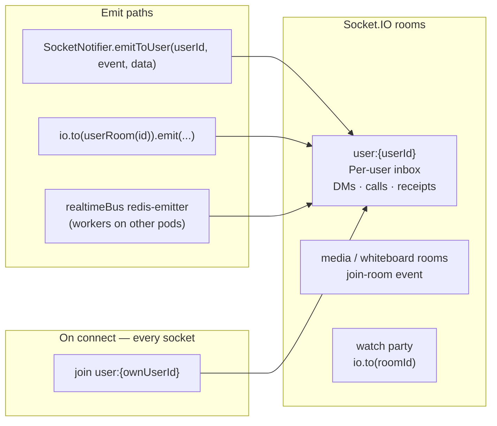
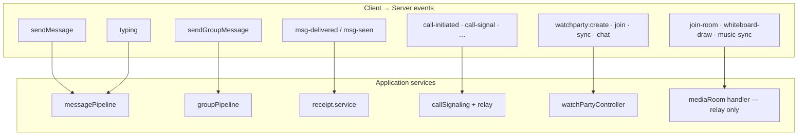
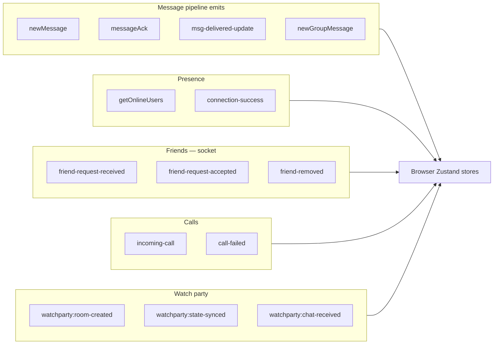
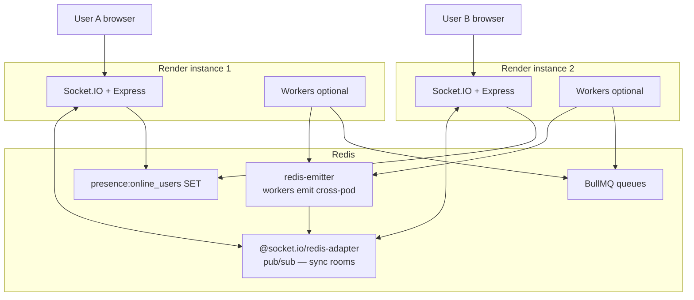
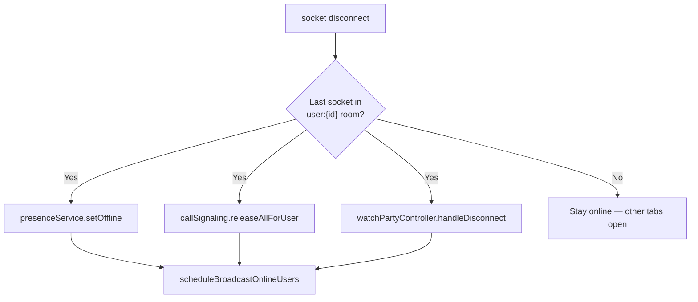

# Socket.IO Realtime Architecture

How **Socket.IO** connects browsers to the backend, authenticates sessions, routes events to handlers, and scales across multiple API instances.

---

## 1. Connection & authentication flow

---

## 2. Server socket stack

---

## 3. Socket rooms & targeting

| Room pattern | Joined when | Used for |
|--------------|-------------|----------|
| `user:{mongoUserId}` | Every authenticated connect | `newMessage`, `incoming-call`, `messageAck`, friend events |
| Ad-hoc room id | `join-room` (DM sorted ids, music) | Whiteboard, `music-sync` |
| Watch party `roomId` | `watchparty:join` | Playback sync, chat, reactions |

---

## 4. Handler → service map

---

## 5. Outbound events (server → client)

*Canonical names: `backend/src/shared/events/socketEvents.js`*

---

## 6. Horizontal scaling (multi-instance)

**Rule:** Any worker delivering a message uses `realtimeEmitToUser` so the correct pod receives the emit target.

---

## 7. Disconnect cleanup

**Frontend:** single socket in `useAuthSocket` → `AuthSocketProvider` → `SocketContext`; reconnect refreshes Clerk token and calls `refetchOpenChat()`.

**Related:** [Messaging](./02-messaging.md) · [Redis pipeline](./05-redis-pipeline-and-watch-party.md)
