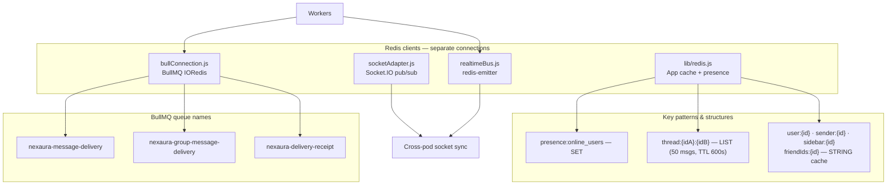
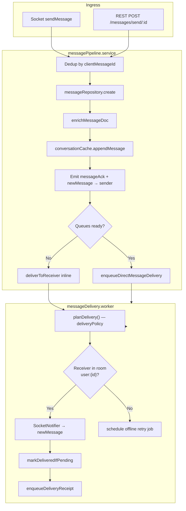
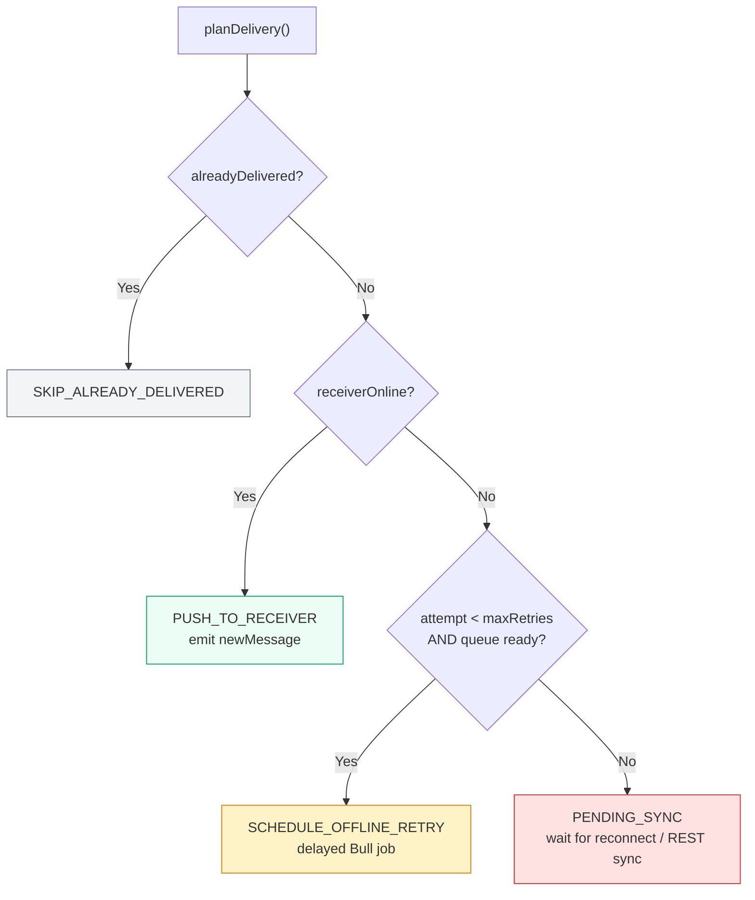
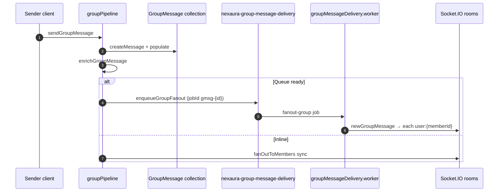
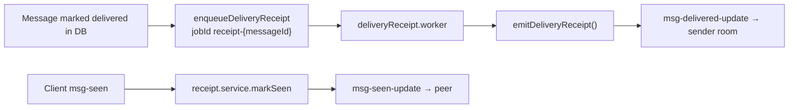
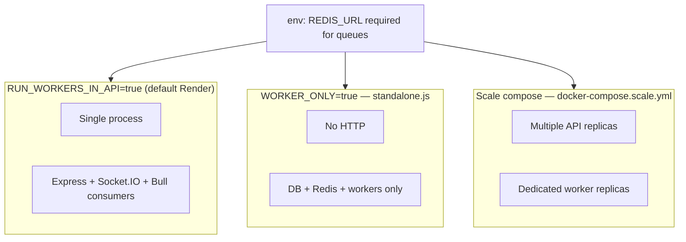
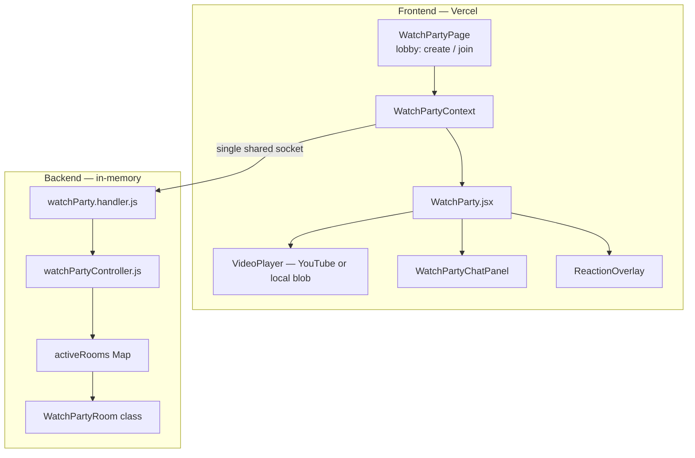
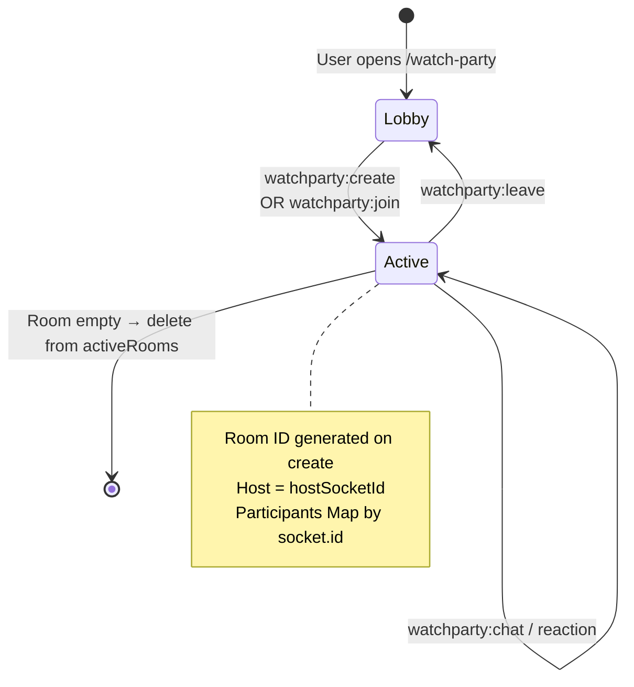
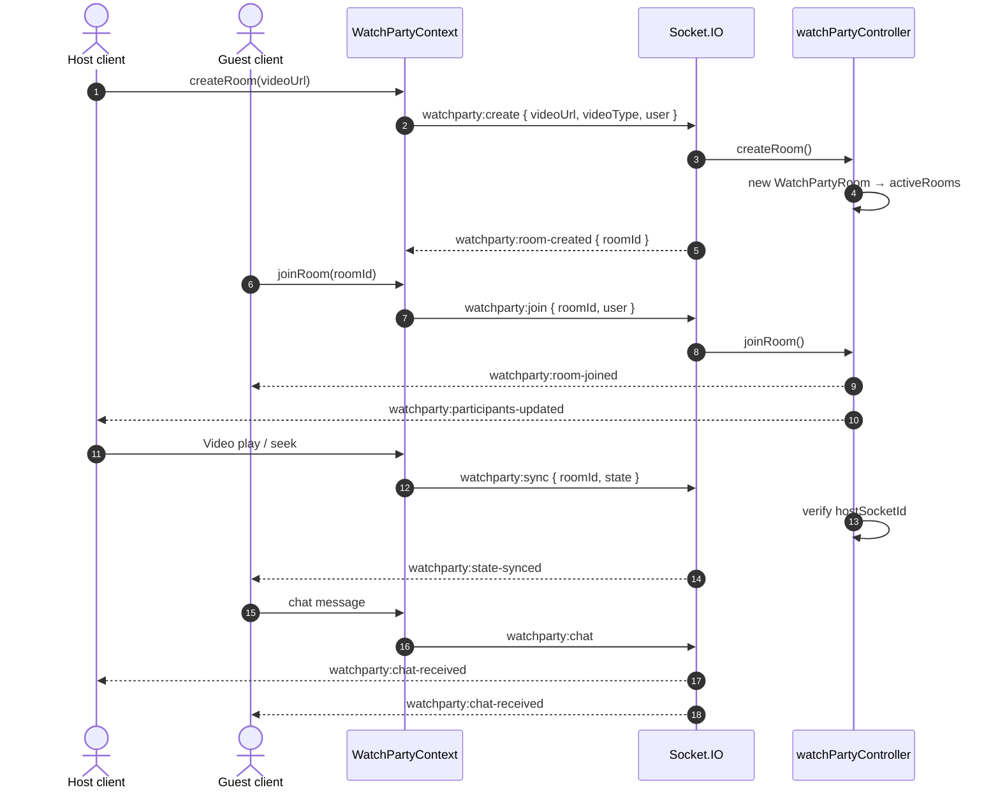
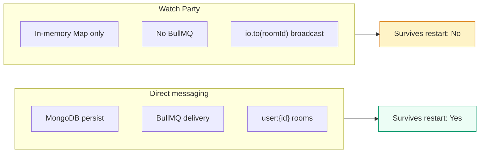

# Redis, Message Pipeline & Watch Party Architecture

Async **message delivery** via BullMQ, **Redis** data structures, and **Watch Party** real-time rooms (in-memory, socket-only).

---

## Part A — Redis & Message Delivery Pipeline

### 1. Redis usage map

| Redis role | When unavailable |
|------------|------------------|
| Presence SET | Falls back; delivery uses socket room membership |
| Thread LIST | Skip cache append; DB still authoritative |
| Bull queues | **Inline delivery** in API process |
| Socket adapter | Single-instance sockets only |

---

### 2. Message pipeline — direct message

---

### 3. Delivery policy (pure domain logic)

*Source: `backend/src/domain/deliveryPolicy.js`*

---

### 4. Group fan-out pipeline

---

### 5. Receipt worker chain

---

### 6. Worker deployment modes

---

## Part B — Watch Party Architecture

Watch Party is **socket-only** and **in-memory** (not stored in MongoDB).

### 7. Watch Party — component diagram

---

### 8. Watch Party — room lifecycle

---

### 9. Watch Party — event flow

---

### 10. Watch Party vs messaging comparison

| Aspect | Messaging | Watch Party |
|--------|-----------|-------------|
| Persistence | MongoDB | `activeRooms` Map |
| Delivery | BullMQ + policy | Immediate socket broadcast |
| Auth | Clerk JWT on socket | Same socket + optional client `user` payload |
| Host rules | N/A | Only host can `watchparty:sync` |

---

## Quick reference — queue jobs

| Queue | Job name | Job ID pattern | Processor |
|-------|----------|----------------|-----------|
| `nexaura-message-delivery` | `deliver-direct` | `msg-{messageId}` | `deliverToReceiver` |
| `nexaura-group-message-delivery` | `fanout-group` | `gmsg-{messageId}` | `fanOutToMembers` |
| `nexaura-delivery-receipt` | `emit-receipt` | `receipt-{messageId}` | `emitDeliveryReceipt` |

**Related:** [Messaging](./02-messaging.md) · [Socket](./04-socket-realtime.md) · [System overview](./01-system-overview.md)
